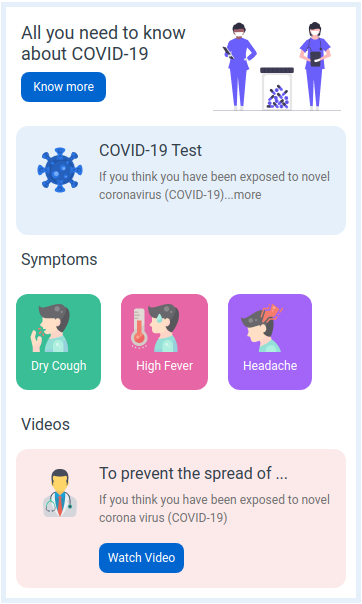

# 🦠 COVID‑19 Awareness Page  

A **simple, informative, and responsive web page** about COVID‑19, built using **HTML, CSS, and Bootstrap**.

---

## 🖼️ Screenshot  



---

## 📖 Overview  

This project is a **static informational website** that covers:
- Key information about COVID‑19
- Symptoms displayed visually
- Quick access to videos and resources  

The page is designed to be **clean, modern, and responsive** for different screen sizes.

---

## 🛠️ Technologies Used  

- **HTML5** – Page structure  
- **CSS3** – Styling and layout  
- **Bootstrap 4.5** – For responsive layout and utilities  
- **Google Fonts** – Custom fonts for better readability  

---

## ✨ Key Features  

- **📱 Responsive Layout** – Works on desktops, tablets, and phones  
- **🎨 Clean UI** – Cards, sections, and visuals for better understanding  
- **🎥 Video Section** – A call‑to‑action section to watch related videos  
- **🩺 Symptoms Display** – Uses icons and colors to show key symptoms  

---

## 🚀 How to Run  

1. **Clone the repository**  
   ```bash
   git clone [https://github.com/himanshusingh45/My-Web-Development-Journey/blob/369cb58f2d55dbeb392e3bfd13c26d18a2da4919/web%20projects/Covid%2019%20page/covid-v1.png]
   ```

2. **Navigate to the project folder**  
   ```bash
   cd covid-19-page
   ```

3. **Open in a browser**  
   Open the `Covid-19-page.html` file in your favorite browser (just double-click it).

---

## 📜 License  

This project is **open-source** and available under the **MIT License**.

---

> *Stay safe. Stay informed.*
