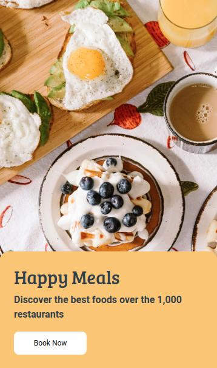

# 🍔 Happy Meals Landing Page  

A **simple, responsive landing page** for “Happy Meals”, built using **HTML, CSS, and Bootstrap**.

---

## 🖼️ Screenshot  



---

## 📖 Overview  

This is a **single-page landing website** for a food discovery concept called **Happy Meals**.  
It features a **background image, a card with title and description, and a clear call-to-action button**.  
The layout is designed to be **clean, attractive, and responsive**.

---

## 🛠️ Technologies Used  

- **HTML5** – Page structure  
- **CSS3** – Styling and custom layout  
- **Bootstrap 4.5** – For responsive design utilities  
- **Google Fonts** – For elegant typography  

---

## ✨ Key Features  

- **📱 Responsive Layout** – Works across all devices  
- **🎨 Attractive Design** – Food-themed background with styled card  
- **👉 Call-to-Action** – “Book Now” button for user engagement  

---

## 🚀 How to Run  

1. **Clone the repository**  
   ```bash
   git clone [https://github.com/himanshusingh45/My-Web-Development-Journey/tree/c16a43e8901e6c86f11105830754f99b15262772/web%20projects]
   ```

2. **Navigate to the project folder**  
   ```bash
   cd happy-meal
   ```

3. **Open in a browser**  
   Open the `happy meal.html` file in your favorite browser (just double-click it).

---

## 📜 License  

This project is **open-source** and available under the **MIT License**.

---

> *Delicious design, simple and effective.*
