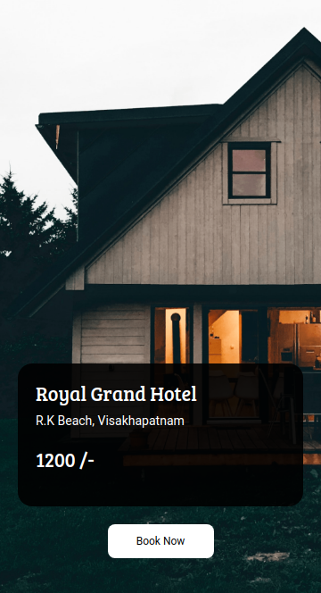

# 🏨 Hotel Booking Landing Page  

A **simple, responsive landing page** for “Royal Grand Hotel”, built using **HTML, CSS, and Bootstrap**.

---

## 🖼️ Screenshot  



---

## 📖 Overview  

This is a **single-page landing website** for a hotel booking concept called **Royal Grand Hotel**.  
It features a **full-screen background image, a card with hotel details (name, location, and price), and a clear call-to-action “Book Now” button**.  
The layout is designed to be **clean, attractive, and responsive**.

---

## 🛠️ Technologies Used  

- **HTML5** – Page structure  
- **CSS3** – Styling and custom layout  
- **Bootstrap 4.5** – For responsive design utilities  
- **Google Fonts** – For elegant typography  

---

## ✨ Key Features  

- **📱 Responsive Layout** – Works across all devices  
- **🎨 Attractive Design** – Hotel-themed background with styled card  
- **👉 Call-to-Action** – “Book Now” button for user engagement  

---

## 🚀 How to Run  

1. **Clone the repository**  
   ```bash
   git clone [https://github.com/himanshusingh45/My-Web-Development-Journey]
