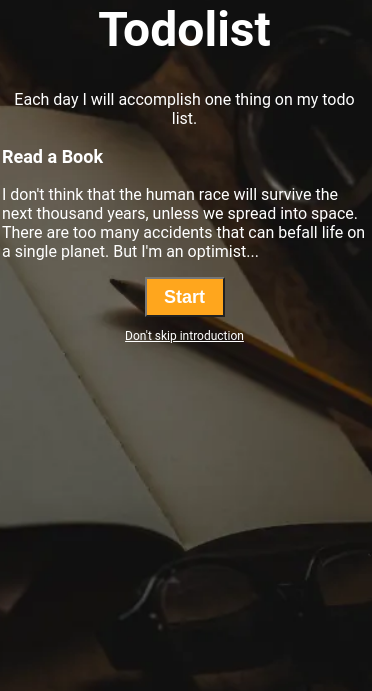

💻 Simple HTML/CSS Practice  
A simple, responsive page for a coding practice exercise, built using HTML, CSS, and Bootstrap.

🖼️ Screenshot  

📖 Overview  
This is a simple single page created as a coding practice exercise.  
It displays a single quote, "Code is more than some bytes in a file.", inside a styled, translucent container with a coding-themed background.  
The layout is designed to be clean, minimalistic, and responsive.

🛠️ Technologies Used  
HTML5 – Page structure  

CSS3 – Styling and custom layout  

Bootstrap 4.5 – For responsive design utilities  

Google Fonts – For typography  

✨ Key Features  
📱 Responsive Layout – Works seamlessly across devices  

🎨 Clean Design – Background image with a stylized quote container  

✨ Translucent Border – The quote is displayed within a semi-transparent, bordered box for a modern look.

🚀 How to Run  
Save the files  
   Save both coding practice1.html and coding practice1.css in the same directory.  

Open in a browser  
   Open the coding practice1.html file in your favorite browser (just double-click it).

📜 License  
This project is open-source and available under the MIT License.

Simple design, powerful message.
